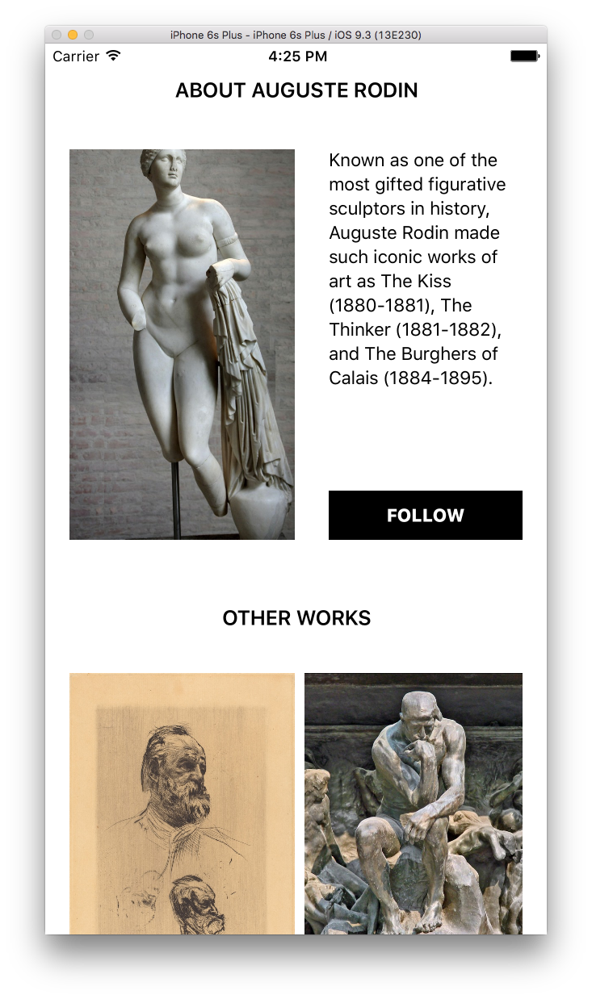

# ImageCachingExamples

### Problem

We want to take snapshots of view controllers that have images in them, like this



The thing is, that is not going to be a small PNG file, and that image downloading is asynchronous. This means that we could end up with slow tests. Boo. Hiss.

One answer to this problem is to work with your caching library in order to end up with snapshots that look like this:


But how do you do that?

### TLDR Solution

Take your view controller, and where you normally have something like this

``` swift
class ViewController: UIViewController {

    @IBOutlet weak var primaryImageView: UIImageView!
    @IBOutlet weak var secondaryImageView: UIImageView!
    @IBOutlet weak var tertiaryImageView: UIImageView!

    let imageOneAddress = "[...]"
    let imageTwoAddress = "[...]"
    let imageThreeAddress = "[...]"

    override func viewDidLoad() {
        super.viewDidLoad()

        // Take the addresses and set the imageview's images asycnhronously
        primaryImageView.setImageWithURL(NSURL(string:imageOneAddress)!)
        secondaryImageView.setImageWithURL(NSURL(string:imageTwoAddress)!)
        tertiaryImageView.setImageWithURL(NSURL(string:imageThreeAddress)!)
    }
}

```

Make an extension on `UIImageView` like so:

``` swift
import UIKit
import SDWebImage

extension UIImageView {

    func or_setImageWithURL(url: NSURL) {

        // Set a coloured background while it loads
        if (image == nil) {
            image = UIImage.imageWithColor(.lightGrayColor())
        }

        // Pass directly to SDWebImage if not in testing environment
        guard NSClassFromString("XCTest") != nil else {
            sd_setImageWithURL(url)
            return
        }

        // Look inside the SD Image Cache to see if our URL has already been stored
        let imageManager = SDWebImageManager.sharedManager()
        let key = imageManager.cacheKeyForURL(url)

        // If not, provide a useful error message, or optionally raise an exception
        guard let cachedImage = imageManager.imageCache.imageFromMemoryCacheForKey(key) else {
            print("Detected a un-stubbed image request for URL: \(url)")
            sd_setImageWithURL(url)
            return
        }

        // Synchronously set the cached image
        image = cachedImage
    }
}
```

Don't worry about the `UIImage.imageWithColor()` calls they just generate images from a colour and cache them, the [source for that is here](https://github.com/orta/ImageCachingExamples/blob/master/ImageCachingExamplesTests/UIImage%2BColor.swift). The important part is the we ask the cache directly for an image and set it - if the class `XCTest` exists.

Next in your tests create an easy way to pre-cache your urls with an image. I use colours because you can easily differentiate each UIImageView and it's going to save space in the PNG.

``` swift
import Quick
import Nimble
import Nimble_Snapshots
import SDWebImage
import UIKit

@testable
import ImageCachingExamples

/// Takes an address, and a colour and caches it for synchronous testing
func cacheColoredImageForURL(string: String, color: UIColor) {
    let image = UIImage.imageWithColor(color)
    SDWebImageManager.sharedManager().saveImageToCache(image, forURL:NSURL(string: string)!)
}

class ViewControllerTests: QuickSpec {
    override func spec() {
        var subject: ViewController!

        beforeEach {
            // This sort of thing can be made more elegant with
            // https://github.com/AliSoftware/SwiftGen

            let storyboard = UIStoryboard(name: "Main", bundle: nil)
            subject = storyboard.instantiateInitialViewController() as! ViewController

            // Use our coloured images in the SDWebCache
            cacheColoredImageForURL(subject.imageOneAddress, color: UIColor.greenColor())
            cacheColoredImageForURL(subject.imageTwoAddress, color: UIColor.blueColor())
            cacheColoredImageForURL(subject.imageThreeAddress, color: UIColor.redColor())
        }

        it("looks right") {
            // Simple snapshot test, to record I did:
            // expect(subject) == recordSnapshot()

            expect(subject) == snapshot()
        }
    }
}
```
